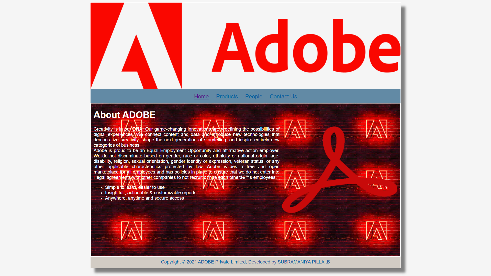
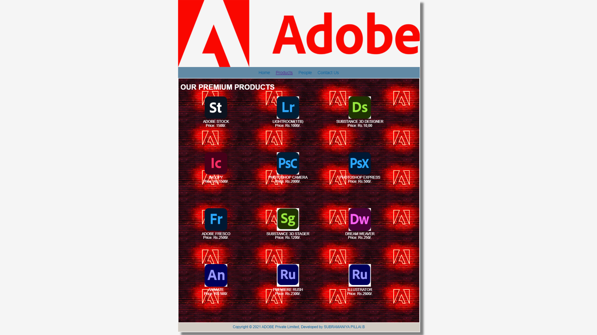
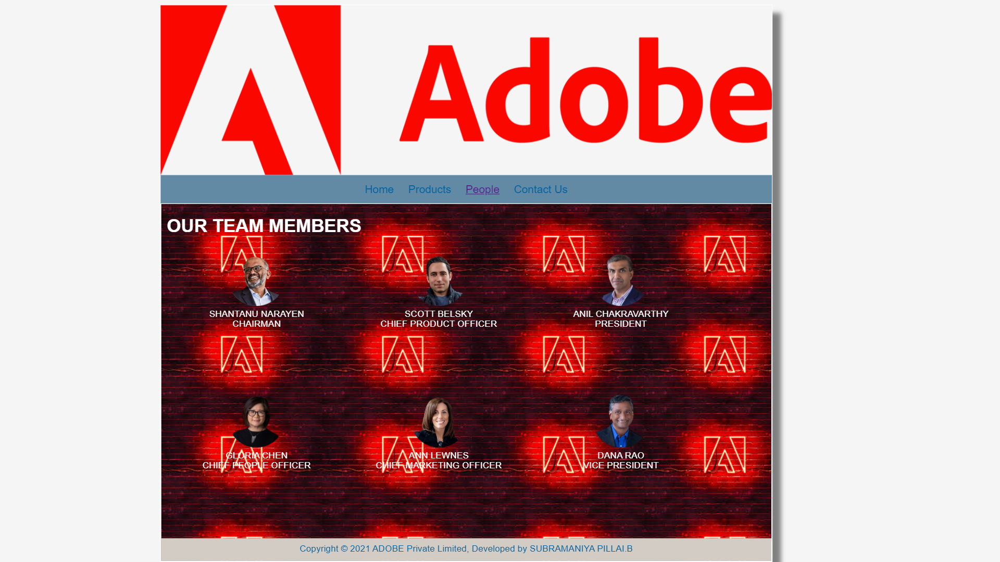
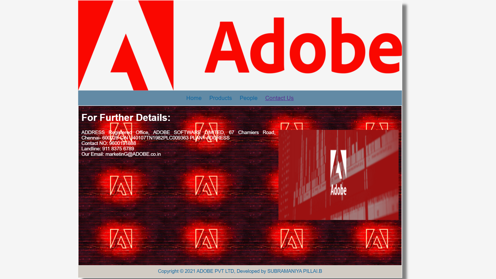

# Web Design for a Software Product Company

## AIM:

To design a static website for a software product company company.

## DESIGN STEPS:

### Step 1:

Requirement collection.

### Step 2:

Creating the layout using HTML and CSS.

### Step 3:

Updating the sample content.

### Step 4:

Choose the appropriate style and color scheme.

### Step 5:

Validate the layout in various browsers.

### Step 6:

Validate the HTML code.

### Step 6:

Publish the website in the given URL.

## PROGRAM :
HOME PAGE:
```
<!DOCTYPE html>
<html lang="en">
  <head>
    <title>ADOBE</title>
    <link rel="stylesheet" href="./css/layout.css" />
    <link rel="icon" href="./img/icon.png" type="image/x-icon" />
  </head>

  <body>
    <div class="container">
      <div class="banner"></div>
      <div class="menu">
        <div class="menuitemselected"><a href="/static/home.html">Home</a></div>
        <div class="menuitem"><a href="/static/products.html">Products</a></div>
        <div class="menuitem"><a href="/static/people.html">People</a></div>
        <div class="menuitem"><a href="/static/Contact.html">Contact Us</a></div>
      </div>
      <div class="content">
        <div class="homecontent">
          <h1>About ADOBE</h1>
          
          <div class="contenttext">
            Creativity is in our DNA. Our game-changing innovations are redefining the possibilities of digital experiences. We connect content and data and introduce new technologies that democratize creativity, shape the next generation of storytelling, and inspire entirely new categories of business.
            <br />
            
Adobe is proud to be an Equal Employment Opportunity and affirmative action employer. We do not discriminate based on gender, race or color, ethnicity or national origin, age, disability, religion, sexual orientation, gender identity or expression, veteran status, or any other applicable characteristics protected by law. 
Adobe values a free and open marketplace for all employees and has policies in place to ensure that we do not enter into illegal agreements with other companies to not recruit or hire each other’s employees.
            <ul>
              <li>Simple to learn, easier to use</li>
              <li>Insightful , actionable & customizable reports</li>
              <li>Anywhere, anytime and secure access</li>
            </ul>
          </div>
        </div>
      </div>
      <div class="footer">
        Copyright &#169; 2021 ADOBE Private Limited, Developed by SUBRAMANIYA PILLAI.B
      </div>
    </div>
  </body>
</html>

```


PRODUCT PAGE:
```
<!DOCTYPE html>
<html lang="en">
  <head>
    <title>ADOBE </title>
    <link rel="stylesheet" href="./css/layout.css" />
    <link rel="icon" href="./img/icon.png" type="image/x-icon" />
  </head>

  <body>
    <div class="container">
      <div class="banner"></div>
      <div class="menu">
        <div class="menuitem"><a href="/static/home.html">Home</a></div>
        <div class="menuitemselected">
          <a href="/static/products.html">Products</a>
        </div>
        <div class="menuitem"><a href="/static/people.html">People</a></div>
        <div class="menuitem"><a href="/static/Contact.html">Contact Us</a></div>
      </div>
      <div class="content">
        <div class="productcontent">    
          <h1>OUR PREMIUM PRODUCTS</h1>
          <div class="productitems">
              <div class="productitem"> 
                  <div class="itemimage">
                  
                  </div>
                  <div class="itemname">ADOBE STOCK</div>
                  <div class="itemprice">Price: 1500/. </div>
              </div>
              <div class="productitem"> 
                  <div class="itemimage">
                  
                  </div>
                  <div class="itemname">LIGHTROOM(1TB)</div>
                  <div class="itemprice">Price: Rs.1000/. </div>
              </div>
              <div class="productitem"> 
                <div class="itemimage">
                
                </div>
                <div class="itemname">SUBSTANCE 3D DESIGNER</div>
                <div class="itemprice">Price: Rs.10,00 </div>
            </div>
            <div class="productitem"> 
              <div class="itemimage">
              
              </div>
              <div class="itemname">INCOPY</div>
              <div class="itemprice">Price: Rs.1500/. </div>
          </div>
          <div class="productitem"> 
            <div class="itemimage">
            
            </div>
            <div class="itemname">PHOTOSHOP CAMERA</div>
            <div class="itemprice">Price: Rs.2000/. </div>
        </div>
        <div class="productitem"> 
          <div class="itemimage">
          
          </div>
          <div class="itemname">PHOTOSHOP EXPRESS</div>
          <div class="itemprice">Price: Rs.500/. </div>
      </div>
      <div class="productitem"> 
        <div class="itemimage">
        
        </div>
        <div class="itemname">ADOBE FRESCO</div>
        <div class="itemprice">Price: Rs.2500/. </div>
    </div>
    <div class="productitem"> 
      <div class="itemimage">
      
      </div>
      <div class="itemname">SUBSTANCE 3D STAGER</div>
      <div class="itemprice">Price: Rs.1200/. </div>
  </div>
  <div class="productitem"> 
    <div class="itemimage">
    
    </div>
    <div class="itemname">DREAM WEAVER</div>
    <div class="itemprice">Price: Rs.250/. </div>
</div>
<div class="productitem"> 
  <div class="itemimage">
  
  </div>
  <div class="itemname">ANIMATE</div>
  <div class="itemprice">Price: RS:500/. </div>
</div>
<div class="productitem"> 
  <div class="itemimage">
  
  </div>
  <div class="itemname">PREMIERE RUSH</div>
  <div class="itemprice">Price: Rs.2300/. </div>
</div>
<div class="productitem"> 
  <div class="itemimage">
  
  </div>
  <div class="itemname">ILLUSTRATOR</div>
  <div class="itemprice">Price: Rs.2600/. </div>
</div>
          </div>
          </div>        
      </div>
      <div class="footer">
        Copyright &#169; 2021 ADOBE Private Limited, Developed by SUBRAMANIYA PILLAI.B
      </div>
    </div>
  </body>
</html>
```
PEOPLE PAGE:
```
<!DOCTYPE html>
<html lang="en">
  <head>
    <title>ADOBE</title>
    <link rel="stylesheet" href="./css/layout.css" />
    <link rel="icon" href="./img/icon.png" type="image/x-icon" />
  </head>

  <body>
    <div class="container">
      <div class="banner"></div>
      <div class="menu">
        <div class="menuitem"><a href="/static/home.html">Home</a></div>
        <div class="menuitem"><a href="/static/products.html">Products</a></div>
        <div class="menuitemselected"><a href="/static/people.html">People</a></div>
        <div class="menuitem"><a href="/static/Contact.html">Contact Us</a></div>
      </div>
      <div class="content">
        <div class="productcontent">    
          <h1>OUR TEAM MEMBERS</h1>
          <div class="productitems">
              <div class="productitem"> 
                  <div class="itemimage">
                  
                  </div>
                  <div class="itemname">SHANTANU NARAYEN</div>
                  <div class="itemprice">CHAIRMAN </div>
              </div>
              <div class="productitem"> 
                  <div class="itemimage">
                  
                  </div>
                  <div class="itemname">SCOTT BELSKY</div>
                  <div class="itemprice">CHIEF PRODUCT OFFICER </div>
              </div>
              <div class="productitem"> 
                <div class="itemimage">
                
                </div>
                <div class="itemname">ANIL CHAKRAVARTHY</div>
                <div class="itemprice">PRESIDENT</div>
            </div>
            <div class="productitem"> 
              <div class="itemimage">
              
              </div>
              <div class="itemname">GLORIA CHEN</div>
              <div class="itemprice">CHIEF PEOPLE OFFICER</div>
          </div>
          <div class="productitem"> 
            <div class="itemimage">
            
            </div>
            <div class="itemname">ANN LEWNES</div>
            <div class="itemprice">CHIEF MARKETING OFFICER</div>
          </div>
          <div class="productitem"> 
            <div class="itemimage">
            
            </div>
            <div class="itemname">DANA RAO</div>
            <div class="itemprice">VICE PRESIDENT</div>
          </div>

          

          </div>        
      </div>
      <div class="footer">
        Copyright &#169; 2021 ADOBE Private Limited, Developed by SUBRAMANIYA PILLAI.B
      </div>
    </div>
  </body>
</html>

```
CONTACTS PAGE:
```
<!DOCTYPE html>
<html lang="en">
  <head>
    <title>adobe private limited</title>
    <link rel="stylesheet" href="./css/layout.css" />
    <link rel="icon" href="./img/pro18.png" type="image/x-icon" />
  </head>

  <body>
    <div class="container">
      <div class="banner"></div>
      <div class="menu">
        <div class="menuitem"><a href="/static/home.html">Home</a></div>
        <div class="menuitem"><a href="/static/products.html">Products</a></div>
        <div class="menuitem"><a href="/static/people.html">People</a></div>
        <div class="menuitemselected"><a href="/static/Contact.html">Contact Us</a></div>
      </div>
      <div class="content">
        <div class="homecontent">
          <h1>For Further Details:</h1>
          
          <div class="contenttext">
            ADDRESS
Registered Office
Turbo Energy Private Limited,
67 Chamiers Road, Chennai- 600028

CIN
U40107TN19IOTWOI239363

PLANT ADDRESS
            <br>
            Contact NO: 9600191888
            <br>
            Landline: 911 8375 6789
            <br>
            Our Email: marketing@turboenergy.co.in
         </div>
        </div>
      </div>
      <div class="footer">
        Copyright &#169; 2021 PACIFIC TECHNOLOGIES PVT LTD, Developed by SUBRAMANIYA PILLAI.B
      </div>
    </div>
  </body>
</html>
```


## OUTPUT:

### Home Page:



### productpage:


### People's page:


### Contact's page:



## Result:

Thus a website is designed for the software product company and the HTML,CSS code are validated.
